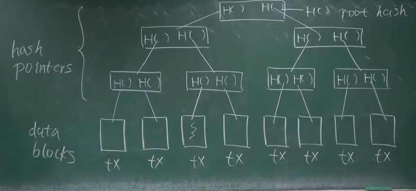

北京大学肖臻老师《区块链技术与应用》公开课
以下是当前视频的整理内容，供您参考：

00:00:05 - 00:01:46
比特币中的数据结构

接下来我们将讨论比特币中的数据结构。这里要用到的一个重要概念是哈希指针。与普通指针不同，哈希指针不仅存储结构体在内存中的地址，还保存了结构体的哈希值。例如，如果 p 是指向某个结构体的普通指针，它只存储该结构体在内存中的起始位置。而哈希指针 h 除了存储地址，还包含结构体的哈希值。这样做的好处是，我们不仅可以找到结构体的位置，还能检测出结构体的内容是否被篡改。比特币的区块链就是由一个个区块组成的链表，其中使用哈希指针代替了普通指针。

00:03:11 - 00:04:21
创世区块和最新区块

链表的最前面是系统中产生的第一个区块，称为创世区块（genesis block）。最后一个区块是最近产生的区块。每个区块都有一个哈希指针指向前一个区块，最后一个区块的哈希也保存在系统中。这种数据结构的优势在于其防篡改特性。

00:04:24 - 00:06:29
哈希指针的数据结构优势

需要注意的是，区块的哈希值是通过将整个区块的内容组合在一起计算得出的。这种数据结构使我们能够实现防篡改日志（tamper-evident log）。如果修改了某个区块的内容，该区块的哈希值就会改变，导致指向它的哈希指针不再匹配。这种变化会一直传递到最新的区块，最终导致系统保存的最新哈希值发生变化。因此，无论在哪个部位进行修改，都会引起我们保存的最新哈希值的变化。

00:06:35 - 00:07:37
哈希指针的多米诺骨牌效应

与普通链表不同，在区块链中，改变任何一个区块都会引发多米诺骨牌效应，导致后面所有区块都需要跟着改变。这种特性使得我们只需保存最新的哈希值，就能保护整个链表。如果需要使用较早的区块，可以向系统中的其他节点请求。

00:07:39 - 00:08:23
去中心化系统中的区块验证

在去中心化系统中，有些节点可能是恶意的。那么如何确保从其他节点获取的区块是正确的呢？这就用到了哈希指针的特性。即使我们只保存了最近的几个区块，当需要验证 earlier 区块时，我们可以计算其哈希值，并与我们保存的哈希值进行比对，从而验证其正确性。

00:09:03 - 00:09:46
默克尔树和二叉树的区别

比特币中另一个重要的数据结构是默克尔树（Merkle Tree）。默克尔树与二叉树的主要区别在于使用哈希指针代替了普通指针。接下来我们将通过一个例子来说明默克尔树的结构。

00:11:41 - 00:13:08
默克尔树的结构

在默克尔树中，最底层是数据块，上面的内部节点都是哈希指针。每个数据块的哈希值存储在其上层节点中。两个相邻节点的哈希值会被组合并再次哈希，形成上一层的节点值。这个过程一直持续到达树的根节点，根节点的哈希值被称为根哈希值。

00:13:13 - 00:14:43
默克尔树的优势

默克尔树的一个主要优势是，只需记住根哈希值就能检测出对树中任何部位的修改。这种结构比链表更高效，因为它是一个二叉树形式。如果对树中任何一个数据块进行修改，变化会一层层传导至根节点，最终导致根哈希值的改变。在比特币中，各个区块之间就是通过哈希指针连接在一起的。

00:14:52 - 00:16:36
比特币区块的结构

在比特币中，每个数据块实际上是一个交易。每个区块分为两部分：区块头和区块体。区块头包含默克尔树的根哈希值，而区块体包含交易的具体列表。

00:16:36 - 00:20:01
默克尔树的用途

默克尔树的一个重要用途是提供默克尔证明。在比特币网络中，节点分为全节点和轻节点两类。全节点保存整个区块的内容，包括区块头和区块体，而轻节点只保存区块头。默克尔证明允许轻节点在不下载整个区块的情况下验证特定交易的存在。这个过程涉及到从特定交易到根节点的路径，称为默克尔路径。

00:20:01 - 00:22:23
轻节点验证交易的方法

当轻节点需要验证某个交易时，它会向全节点请求相关的默克尔路径。全节点会提供从目标交易到根节点路径上的必要哈希值。轻节点接收到这些信息后，可以在本地计算出根哈希值，并与其保存的区块头中的根哈希值进行比较，从而验证交易的存在性。

00:22:27 - 00:26:03
默克尔证明的验证过程

轻节点在收到默克尔证明后，只需要从下往上验证路径上的哈希值是否正确。这个过程只能验证特定交易所在的分支，而无法验证树中其他部分。如果最终计算出的根哈希值与区块头中保存的值相匹配，就可以确认该交易确实存在于区块中。

00:26:13 - 00:30:01
哈希值的不可篡改性

有人可能会质疑，是否可以通过调整不需验证的哈希值来伪造证明。然而，这在实际中是不可行的，因为这相当于人为制造哈希碰撞，这在密码学上是极其困难的。这种特性保证了默克尔证明的可靠性。

00:30:03 - 00:31:53
默克尔证明的复杂度

对于包含 n 个交易的区块，默克尔证明的复杂度是对数级别的，这使得它非常高效。然而，证明某个交易不存在则相对困难，如果不对叶节点的排列顺序做任何假设，就需要线性复杂度。

00:32:00 - 00:34:59
有序默克尔树的证明方法

如果我们对叶节点按照交易的哈希值排序，就可以更高效地证明交易的不存在。这种结构称为有序默克尔树。在有序默克尔树中，我们可以提供两个相邻节点的证明，如果要查找的交易应该在这两个节点之间但实际上不存在，就可以证明该交易不在树中。

00:35:05 - 00:37:27
比特币中的默克尔树应用

比特币中使用的是未排序的默克尔树，因为比特币系统中并不需要进行不存在性证明。值得注意的是，哈希指针可以用于任何无环数据结构，但不适用于有环结构，因为这会导致循环依赖问题。

这就是我们今天第二节课的主要内容，介绍了比特币中使用的两种基本数据结构：区块链和默克尔树，它们都是基于哈希指针构建的。
