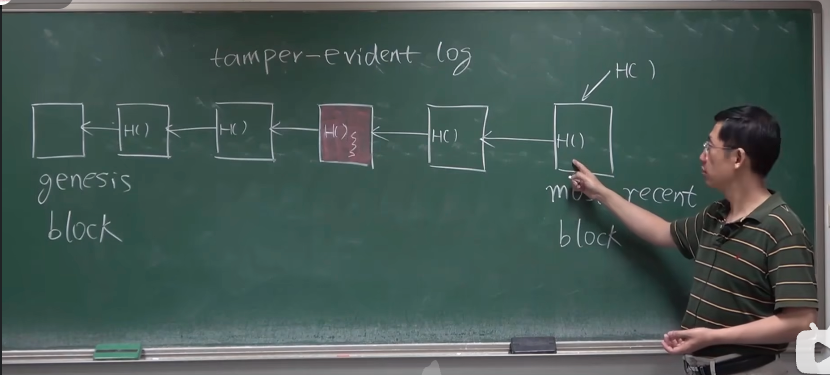
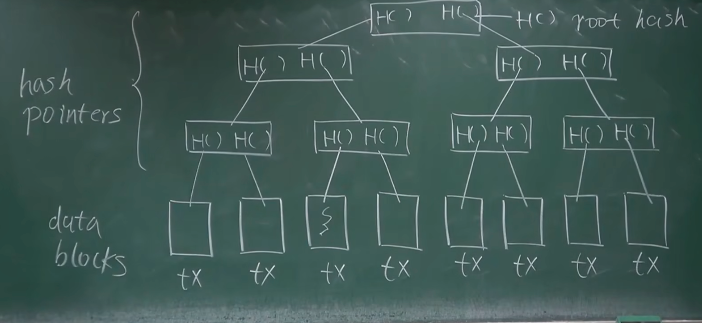

# 比特币的数据结构(Bitcoin's Data Structures)

[课程链接](https://www.bilibili.com/video/BV1Vt411X7JF?spm_id_from=333.788.videopod.episodes&vd_source=74bce47dc91fea0f83d6bc4f3e792e47&p=3)

下图是一个比特币网络中的数据结构：

The following image represents the data structure in a Bitcoin network:

## 哈希指针(Hash Pointer)

定义：哈希指针不仅存储结构体在内存中的地址，还保存了结构体的哈希值。

Definition: Hash pointer not only stores the address of the structure in memory, but also stores the hash value of the structure.

优势：能够检测结构体内容是否被篡改

Advantages: It can detect whether the content of the structure has been modified.

注意：哈希指针不适用于有环数据结构，因为会导致循环依赖问题。

Note: Hash pointers are not suitable for cyclic([ˈsaɪklɪk]) data structures because they will cause circular dependency problems.

## 区块链数据结构(Blockchain Data Structure)

定义：区块链是一个使用哈希指针连接的链表结构。

Definition: Blockchain is a linked list structure using hash pointers.

特点：

1. 链表最前面是创世区块（genesis block）
2. 最后一个区块是最新产生的区块
3. 每个区块都有一个哈希指针指向前一个区块
4. 系统中保存最新区块的哈希值

Characteristics:

1. The first block in the chain is the genesis([ˈdʒenəsɪs]) block
2. The last block is the latest block
3. Each block has a hash pointer pointing to the previous block
4. The system saves the hash value of the latest block

防篡改特性：

- 修改任何一个区块都会引发"多米诺骨牌效应"，导致后续所有区块的哈希值改变
- 只需保存最新的哈希值，就能保护整个链表

Tamper-resistant feature:

- Modifying any block will trigger a "domino effect," causing the hash values of all subsequent blocks to change
- By storing only the latest hash value, the entire linked list can be protected

## 区块验证

即使只保存了最近的几个区块，当需要验证较早的区块时，可以：

1. 向其他节点请求该区块
2. 计算其哈希值
3. 与保存的哈希值进行比对，验证其正确性

Even if only the most recent few blocks are stored, when verification of an earlier block is needed, we can:

1. Request the block from other nodes
2. Calculate its hash value
3. Compare it with the stored hash value to verify its correctness

## 默克尔树（Merkle Tree）

定义：默克尔树是一种使用哈希指针的二叉树结构。

Definition: Merkle tree is a binary tree structure using hash pointers.

组成部分：

1. 叶子节点：存储实际的数据(在比特币中存放交易信息)
2. 中间节点：由其子节点的哈希值计算得出
3. 根节点：树的顶部节点，代表整个树的哈希值（根哈希值）

Components:

1. Leaf nodes: Store actual data (in Bitcoin, transaction information)
2. Intermediate nodes: Calculated from the hash values of their child nodes
3. Root node: The top node of the tree, representing the hash value of the entire tree (root hash)

构建过程:

1. 将所有交易数据放在叶子节点上
2. 相邻两个叶子节点的哈希值合并后再次哈希，形成父节点
3. 重复步骤 2，直到得到根节点

Construction process:

1. Place all transaction data on leaf nodes
2. Combine and hash the hash values of adjacent leaf nodes to create parent nodes
3. Repeat step 2 until the root node is obtained

优势：

1. 高效验证：只需要根哈希就能验证整个树的完整性
2. 快速更新：修改一个叶子节点只需要更新其路径上的节点

Advantages:

1. Efficient verification: Only the root hash is needed to verify the integrity of the entire tree
2. Quick updates: Modifying a leaf node only requires updating the nodes on its path

### 默克尔树与区块链的关系(Relationship between Merkle Trees and Blockchain)

默克尔树在比特币区块链中扮演着重要角色：

1. 每个区块包含一个默克尔树，用于组织该区块中的所有交易
2. 区块头中包含默克尔树的根哈希值，这个根哈希值代表了该区块中所有交易的摘要
3. 默克尔树使得轻节点能够在不下载整个区块的情况下验证交易，提高了效率

Merkle trees play an important role in the Bitcoin blockchain:

1. Each block contains a Merkle tree for organizing all transactions in the block
2. The root hash of the Merkle tree is included in the block header, representing a summary of all transactions in the block
3. The Merkle tree allows light nodes to verify transactions without downloading the entire block, improving efficiency

### 比特币区块的结构(Structure of a Bitcoin Block)

比特币区块由两部分组成：

1. 区块头：包含默克尔树的根哈希值
2. 区块体：包含交易的具体列表

Bitcoin blocks consist of two parts:

1. Block header: Contains the root hash of the Merkle tree
2. Block body: Contains the specific list of transactions

### 比特币中的节点类型(Node Types in Bitcoin)

比特币由两种节点组成：

1. 全节点：

   - 保存完整的区块链数据，包括所有区块的头部和交易数据

2. 轻节点（SPV 节点）：

   > SPV: Simplified Payment Verification (简化支付验证)

   - 只保存区块头信息，不存储完整的交易数据

Bitcoin consists of two types of nodes:

1. Full nodes:

   - Store the entire blockchain data, including the headers and transaction data of all blocks

2. Light nodes (SPV nodes):

   - Only store the block header information, not the complete transaction data

### 默克尔证明(Merkle Proof)

定义：默克尔证明是一种证明特定交易存在于区块中的方法，主要用于轻节点验证交易。

Definition: Merkle proof is a method for proving that a specific transaction exists in a block, mainly used for light node verification.

过程：

1. 轻节点向全节点请求特定交易的默克尔路径
2. 全节点提供从目标交易到根节点路径上的必要哈希值
3. 轻节点使用这些哈希值在本地计算根哈希值
4. 轻节点将计算得到的根哈希值与其保存的区块头中的根哈希值进行比较

Process:

1. Light nodes request the Merkle path for a specific transaction from full nodes
2. Full nodes provide the necessary hash values on the path from the target transaction to the root node
3. Light nodes use these hash values to calculate the root hash value locally
4. Light nodes compare the calculated root hash value with the root hash value in the block header saved in their local storage

### 重要英语词汇短语

- consist of [kənˈsɪst] 由...组成
  - Bitcoin blocks consist of two parts
- independently [ɪndɪˈpɛndəntli] 独立地
  - Can independently verify all transactions and blocks
- participate in [pɑːˈtɪsɪpeɪt ɪn] 参与
  - Participate in the transaction broadcast and block propagation
- verification [ˌverɪfɪˈkeɪʃn] 验证
  - Simplified Payment Verification (SPV) is used by light nodes
- specific [spəˈsɪfɪk] 特定的
  - Light nodes request Merkle proofs for specific transactions
